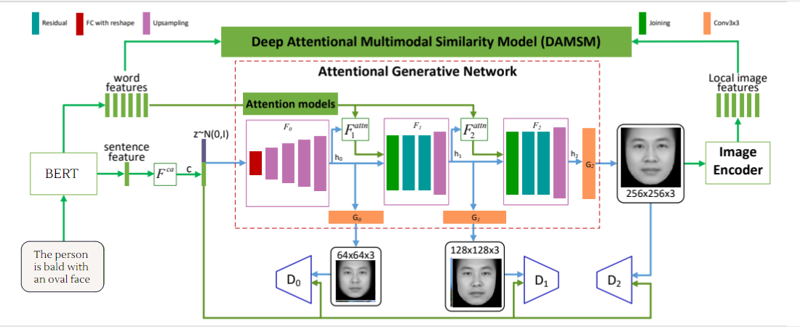

# AttnGANbert
In this repo lies our code for implementing the AttnGAN architecture using BERT as our text-encoder in the DAMSM architecture

## Folder Strucutre
The Folder structure is as follows

## Architechture

## Dependencies
python 3.7.
pytorch
Download all other dependencies as listed in requirement.txt

DATA
Download the CelebAText-HQ dataset and extract it to data -> CelebAText-HQ

Training
* To pre-train DAMSM models:
	* python pretrain_DAMSM.py --cfg cfg/face.yml --gpu 0
* To train image generator models: 
	* python main.py --cfg cfg/train_face.yml --gpu 0
